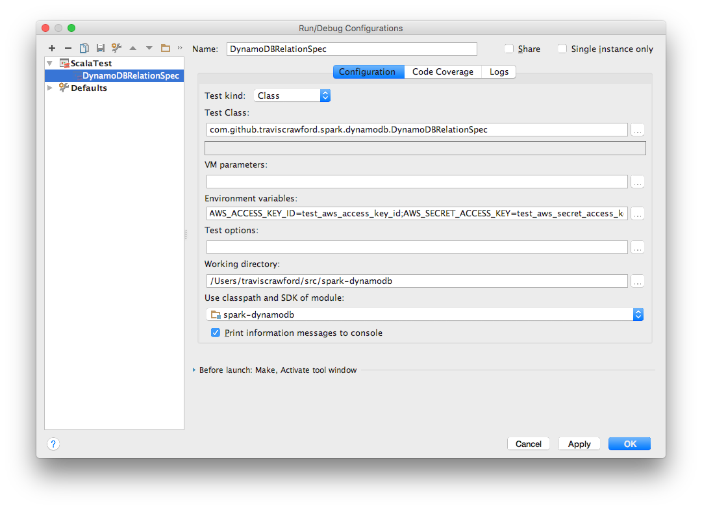

# Developers Guide

<!-- START doctoc generated TOC please keep comment here to allow auto update -->
<!-- DON'T EDIT THIS SECTION, INSTEAD RE-RUN doctoc TO UPDATE -->
**Table of Contents**  *generated with [DocToc](https://github.com/thlorenz/doctoc)*

- [Testing](#testing)
  - [Run Tests](#run-tests)
  - [Install Snapshots Locally without tests/signing](#install-snapshots-locally-without-testssigning)
  - [Run/debug tests in your IDE](#rundebug-tests-in-your-ide)
- [How To](#how-to)
  - [Release to Maven Central](#release-to-maven-central)
  - [Develop in Docker](#develop-in-docker)

<!-- END doctoc generated TOC please keep comment here to allow auto update -->

## Testing

### Run Tests
Run tests as usual from the command-line with maven:

```bash
mvn integration-test
```

### Install Snapshots Locally without tests/signing

When integration testing it may be useful to install in your local maven repository without running
tests or signing the artifacts. You can do this with:

```bash
mvn install -DskipTests -Dgpg.skip
```

### Run/debug tests in your IDE
Run tests within your IDE as appropriate for the tool. Note you will need to export the following two environment variables in your run configuration for tests to pass.

```bash
AWS_ACCESS_KEY_ID=test_aws_access_key_id
AWS_SECRET_ACCESS_KEY=test_aws_secret_access_key
```

For example, in IntelliJ you can edit the run configuration and set environment variables.



## How To

### Release to Maven Central

This library is published to [Maven Central](http://search.maven.org/) so other can
easily depend on it.

To release, there are a number of prerequisites:

* You need permissions to publish artifacts -
  see [OSSRH-24019](https://issues.sonatype.org/browse/OSSRH-24019).
* You need GPG setup to sign artifacts.
  [GPGTools](https://gpgtools.org/) might be useful for managing your keys.

First, prepare the release. This will build and sign the deploy artifacts.

```
mvn release:clean release:prepare
```

If preparing the release looks good you can release to the Sonatype OSS repo,
which is mirrored by Maven Central.

```
mvn release:perform
```

If the release was successful, push the local changes that maven made during
the release to GitHub.

```
git push
git push --tags
```

### Develop in Docker

To ensure a consistent development environment, we develop in a Docker container.

Build the development container image with the following command. In most cases you only
need to do this once, when doing your first build.

```
docker build -t spark-dynamodb-dev .
```

Run the container with the following command. Notice this establishes a bash session,
and bind mounts both the project working directory and maven cache into the container.

```
docker run -it -v ~/.m2:/root/.m2 -v "${PWD}":/src -w /src spark-dynamodb-dev bash
```

From a workflow perspective, you can make changes outside the container using your favorite
tools (e.g.: IntelliJ), and build inside the container.
